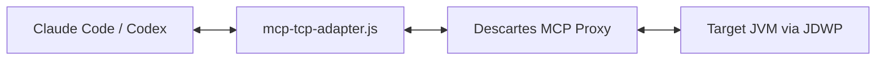
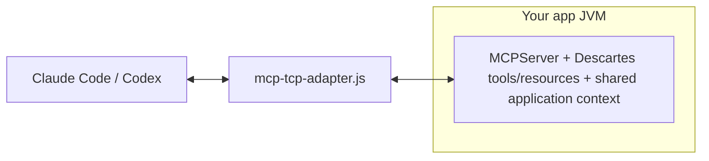

# Descartes MCP

Debug live JVMs from MCP clients like Codex CLI and Claude Code.

Descartes has two operating modes:

- Proxy mode for external debugging against JDWP-enabled JVMs.
- Embedded mode for full in-process runtime tooling (JShell, profiler, hot reload, resources, and more).

> Security: run only in trusted development/test environments. JDWP and debugger tools can inspect memory, evaluate code, and suspend application threads.

---

## Why You Should Use Descartes

- Debug JDWP-enabled JVMs without restarting application code.
- Investigate blocked and waiting execution paths with debugger thread/stack tools (`debugger_threads`, `debugger_stacktrace`).
- Share a repeatable debugging workflow with AI-assisted agent tooling.
- Move from proxy-first debugging to embedded, full-runtime introspection when needed.

---

## Try It

Prerequisites: JDK 17+, Maven 3+, Node.js.

Pick a scenario below. Both use the included `BuggyCalculator` example app, which contains six intentional bugs (off-by-one, NPE, integer overflow, wrong conditional, edge-case handling, swapped business logic).

> First check MCP registration below; that needs to be done before you try one of the scenarios below
> 
### Scenario A -- Agent does everything (unattended)

The agent builds, launches, connects, and debugs without manual intervention. You only type the prompt.

**Step 1 -- Start the proxy in a separate terminal**

```bash
./scripts/run-remote-proxy-from-maven.sh
```

Exposes MCP on port `9090`, configured to reach JDWP on `localhost:5005` (the actual JDWP connection happens later, when the agent starts a debug session). By default it uses the version from `pom.xml`; pass `--version <version>` to pin a specific release artifact.

For local source builds during development, use `./scripts/run-remote-proxy.sh` instead.

**Step 2 -- Ask the agent to debug**

Open Claude Code or Codex from this repo and paste:

> Build with `mvn clean package -DskipTests`, launch
> `com.bitsapplied.descartes.example.debugger.DebuggerWorkflowExample`
> with JDWP in `--interactive` mode, then find the six bugs in
> `com.bitsapplied.descartes.example.debugger.scenarios.BuggyCalculator`.

The debug skill handles launch mechanics (script, JDWP flags, port). The agent connects and steps through all six bugs autonomously.

The `.mcp.json` in this repo is pre-configured for the proxy. No other setup needed.

### Scenario B -- You launch the app, agent connects

You start the target app yourself (useful when reproducing a specific state, or when the app requires manual setup). The agent only attaches and debugs.

**Step 1 -- Build the JAR (once)**

```bash
mvn clean package -DskipTests
```

**Step 2 -- Start the proxy in a separate terminal**

```bash
./scripts/run-remote-proxy-from-maven.sh
```

**Step 3 -- Launch the example app with JDWP in another terminal**

```bash
mkdir -p .pids
scripts/launch-managed-nontty.sh \
  --name buggy-calc \
  -- java \
     -agentlib:jdwp=transport=dt_socket,server=y,suspend=n,address=localhost:5005 \
     -cp target/descartes-mcp-*-jar-with-dependencies.jar \
     com.bitsapplied.descartes.example.debugger.DebuggerWorkflowExample \
     --interactive </dev/null 2>&1 | tee .pids/buggy-calc.log
```

Wait for `Listening for transport dt_socket at address: 5005` before continuing.

`launch-managed-nontty.sh` requires non-TTY file descriptors. The `</dev/null 2>&1 | tee` redirection satisfies that: stdin comes from `/dev/null`, stderr merges into stdout, and the pipe to `tee` makes stdout non-TTY while still printing to your terminal.

**Step 4 -- Ask the agent to debug**

Open Claude Code from this repo and ask:

> The BuggyCalculator app is already running with JDWP on port 5005. Connect the debugger and find the bugs in BuggyCalculator.

The agent will connect to the existing JDWP session and debug without trying to launch anything.

**Step 5 -- Clean up when done**

Stop the app using the PID file:

```bash
kill "$(cat .pids/buggy-calc.pid)"
```

### MCP registration

**Claude Code** -- works out of the box from this repo (`.mcp.json` already present).

**Codex CLI** -- two setup steps, then restart Codex:

```bash
# 1. Install the debug skill (symlink, no file duplication)
.claude/skills/debug/scripts/install-codex-link.sh

# 2. Register the MCP server
codex mcp add descartes-proxy \
  --env MCP_HOST=localhost \
  --env MCP_PORT=9090 \
  -- node $(pwd)/config/mcp/mcp-tcp-adapter.js
```

Both steps are one-time setup. The skill symlink means Codex always sees the latest skill from this repo.

### Debug your own app

Start your app with JDWP and ask the agent to connect:

```bash
java -agentlib:jdwp=transport=dt_socket,server=y,suspend=n,address=localhost:5005 -jar your-app.jar
```

Use `address=*:5005` to listen on all interfaces (remote debugging). If your shell is zsh, quote the flag to prevent glob expansion: `'-agentlib:jdwp=...,address=*:5005'`.

### Debug skill (recommended for agents)

Copy the debug skill into your target project for structured debugging workflows:

```bash
mkdir -p .claude/skills
cp -R /path/to/descartes-mcp/.claude/skills/debug ./.claude/skills/
```

See [doc/debug-skill.md](doc/debug-skill.md) for Codex CLI setup.

---

## How It Fits

Proxy mode:



Embedded mode:



Use proxy mode when you want external, agent-driven inspection via JDWP.
Use embedded mode when you want full Descartes capabilities in-process.

---

## Modes: Which One To Start With

| Path | Setup | Best for |
| --- | --- | --- |
| Proxy mode | Minutes | Debugging existing JDWP-enabled JVMs with no application code changes |
| Embedded mode | Requires dependency changes | JShell, profiling, hot reload, and deeper introspection |

---

## Known Restriction

One proxy instance can target one JVM at a time. For multi-JVM workflows, run one proxy per target JVM or pick different ports.

See [doc/restrictions.md](doc/restrictions.md).

---

## Quick Tips

- Stop cleanly: end MCP usage, stop proxy with `Ctrl+C`, then stop target JVM.
- Port setup: keep adapter MCP port (`MCP_PORT`) aligned with proxy `--mcp-port`. Configure JDWP host/port separately for the target JVM.
- For agent-launched targets, use non-TTY launch and include the same JDWP flag used in manual startup.
- For JDK 21+ virtual-thread targets, add `includevirtualthreads=y` to the target JVM's JDWP flag when you need virtual threads to appear in thread-list snapshots.
- When debugging Descartes itself, set `DESCARTES_FORCE_PLATFORM_THREADS=true` or `-Dtools.executor.virtualThreads.enabled=false` to run shared tool tasks on bounded platform threads.

---

## Learn More

- [doc/quick-start.md](doc/quick-start.md)
- [doc/adapter.md](doc/adapter.md)
- [doc/debugger.md](doc/debugger.md)
- [doc/how-to-embed.md](doc/how-to-embed.md)
- [doc/debug-skill.md](doc/debug-skill.md)
- [doc/restrictions.md](doc/restrictions.md)
