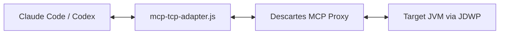
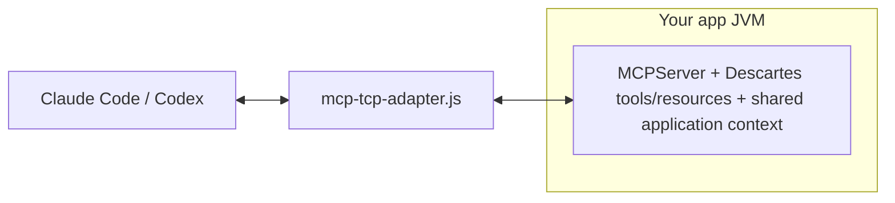

# Descartes MCP

Debug live JVMs from MCP clients like Codex CLI and Claude Code.

Descartes has two operating modes:

- Proxy mode for external debugging against JDWP-enabled JVMs.
- Embedded mode for full in-process runtime tooling (JShell, profiler, hot reload, resources, and more).

> Security: run only in trusted development/test environments. JDWP and debugger tools can inspect memory, evaluate code, and suspend application threads.

---

## Why You Should Use Descartes

- Debug JDWP-enabled JVMs without restarting application code.
- Investigate blocked and waiting execution paths with debugger thread/stack tools (`debugger_threads`, `debugger_stacktrace`).
- Share a repeatable debugging workflow with AI-assisted agent tooling.
- Move from proxy-first debugging to embedded, full-runtime introspection when needed.

---

## Fast Demo (Codex CLI)

Run these commands:

```bash
./scripts/run-remote-proxy.sh --jdwp-host localhost --jdwp-port 5005 --mcp-port 9090
```

```bash
codex mcp add descartes-proxy \
  --env MCP_HOST=localhost \
  --env MCP_PORT=9090 \
  --env MCP_DEBUG=false \
  -- node /absolute/path/to/descartes-mcp/config/mcp/mcp-tcp-adapter.js
```

```bash
.claude/skills/debug/scripts/install-codex-link.sh
```

Restart Codex CLI once so the new skill registration is picked up.

```bash
java -agentlib:jdwp=transport=dt_socket,server=y,suspend=n,address=*:5005 -jar your-app.jar
```

Then tell your agent:  
"Use the debug skill to inspect the failure in this running app and reproduce the thread state around the exception path."

---

## Quick Start (Minimal)

### 1) Prerequisites

JDK 17+, Node.js, and a Java process that can run with JDWP.

### 2) Start proxy

```bash
./scripts/run-remote-proxy.sh --jdwp-host localhost --jdwp-port 5005 --mcp-port 9090
```

The script auto-builds `target/descartes-mcp-*-jar-with-dependencies.jar` if missing or stale.

### 3) Register MCP adapter

Codex CLI:

```bash
codex mcp add descartes-proxy \
  --env MCP_HOST=localhost \
  --env MCP_PORT=9090 \
  --env MCP_DEBUG=false \
  -- node /absolute/path/to/descartes-mcp/config/mcp/mcp-tcp-adapter.js
```

Claude Code (`.mcp.json`):

```json
{
  "mcpServers": {
    "descartes-proxy": {
      "command": "node",
      "args": [
        "/absolute/path/to/descartes-mcp/config/mcp/mcp-tcp-adapter.js"
      ],
      "env": {
        "MCP_HOST": "localhost",
        "MCP_PORT": "9090",
        "MCP_DEBUG": "false"
      }
    }
  }
}
```

### 4) Install debug skill

In the target project repository (the app you are debugging):

```bash
# From the target project root
mkdir -p .claude/skills
cp -R /path/to/descartes-mcp/.claude/skills/debug ./.claude/skills/
mkdir -p scripts
cp /path/to/descartes-mcp/scripts/launch-managed-nontty.sh ./scripts/
.claude/skills/debug/scripts/preflight.sh
```

For Codex CLI in that target project, run:

```bash
.claude/skills/debug/scripts/install-codex-link.sh
```

Then restart Codex CLI (or your terminal session).

### 5) Debug

Start your app in JDWP mode and ask your agent to use the debug skill.

```bash
java -agentlib:jdwp=transport=dt_socket,server=y,suspend=n,address=*:5005 -jar your-app.jar
```

### Optional: Build manually

```bash
mvn clean package -DskipTests
```

---

## How It Fits

Proxy mode:



Embedded mode:



Use proxy mode when you want external, agent-driven inspection via JDWP.
Use embedded mode when you want full Descartes capabilities in-process.

---

## Modes: Which One To Start With

| Path | Setup | Best for |
| --- | --- | --- |
| Proxy mode | Minutes | Debugging existing JDWP-enabled JVMs with no application code changes |
| Embedded mode | Requires dependency changes | JShell, profiling, hot reload, and deeper introspection |

---

## What CodexCLI / Claude Code Can Do First In Proxy Mode

- Pause and step through execution at breakpoints.
- Inspect locals and object fields on suspended stack frames.
- Capture thread states and stack traces for blocked/waiting paths.
- Evaluate expressions in suspended-frame context.

---

## Known Restriction

One proxy instance can target one JVM at a time. For multi-JVM workflows, run one proxy per target JVM or pick different ports.

See [doc/restrictions.md](doc/restrictions.md).

---

## Quick Tips

- Stop cleanly: end MCP usage, stop proxy with `Ctrl+C`, then stop target JVM.
- Port setup: keep adapter MCP port (`MCP_PORT`) aligned with proxy `--mcp-port`. Configure JDWP host/port separately for the target JVM.
- Non-TTY launch (agent target workloads):  
  `scripts/launch-managed-nontty.sh --name myapp -- java -jar your-app.jar`

---

## Learn More

- [doc/quick-start.md](doc/quick-start.md)
- [doc/adapter.md](doc/adapter.md)
- [doc/debugger.md](doc/debugger.md)
- [doc/how-to-embed.md](doc/how-to-embed.md)
- [doc/debug-skill.md](doc/debug-skill.md)
- [doc/restrictions.md](doc/restrictions.md)
