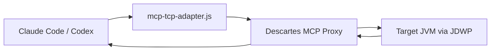

# Descartes MCP

Debug live JVMs instantly from your MCP client.

Descartes MCP connects directly to a running Java process over JDWP and gives your agent a stable, structured debug surface: threads, stack state, variables, breakpoints, and runtime introspection flow.

It works in two modes:

- Proxy mode for immediate external debugging against any JDWP-enabled JVM.
- Embedded mode for full runtime introspection inside your app (JShell, profiler, hot reload, resources, and more).

---

## Why Teams Use Descartes

- Debug running production-like JVMs without restarting.
- Investigate thread contention, lock waits, and broken state in real time.
- Share a repeatable debugging workflow with AI-assisted agent tooling.
- Scale from one-off incidents to repeated workflows with documented tool usage.

---

## 30-Second Demo

Run these three commands and ask your agent to debug.

```bash
./scripts/run-remote-proxy.sh --jdwp-host localhost --jdwp-port 5005 --mcp-port 9090
```

```bash
codex mcp add descartes-proxy \
  --env MCP_HOST=localhost \
  --env MCP_PORT=9090 \
  --env MCP_DEBUG=false \
  -- node /absolute/path/to/descartes-mcp/config/mcp/mcp-tcp-adapter.js
```

```bash
java -agentlib:jdwp=transport=dt_socket,server=y,suspend=n,address=*:5005 -jar your-app.jar
```

Then tell your agent:  
“Use the debug skill to inspect the failure in this running app and reproduce the thread state around the exception path.”

---

## Quick Start (Minimal)

### 1) Prerequisites

JDK 17+, Node.js, and a Java process that can run with JDWP.

### 2) Build the proxy artifact once

```bash
mvn clean package -DskipTests
```

`scripts/run-remote-proxy.sh` expects `target/descartes-mcp-*-jar-with-dependencies.jar`.

### 3) Run proxy

```bash
./scripts/run-remote-proxy.sh --jdwp-host localhost --jdwp-port 5005 --mcp-port 9090
```

### 4) Register MCP adapter

```bash
codex mcp add descartes-proxy \
  --env MCP_HOST=localhost \
  --env MCP_PORT=9090 \
  --env MCP_DEBUG=false \
  -- node /absolute/path/to/descartes-mcp/config/mcp/mcp-tcp-adapter.js
```

Install Codex skill bridge for local prompts:

```bash
.claude/skills/debug/scripts/install-codex-link.sh
```

Claude Code users configure the same adapter command in MCP JSON with `MCP_PORT=9090`.

### 5) Debug

Start your app in JDWP mode and ask your agent to use the debug skill.

```bash
java -agentlib:jdwp=transport=dt_socket,server=y,suspend=n,address=*:5005 -jar your-app.jar
```

---

## How It Fits



Use proxy mode when you want fast, external, agent-driven inspection.
Use embed mode when you want full Descartes capabilities inside your app.

---

## Modes: Which one to start with

| Path | Setup | Best for |
| --- | --- | --- |
| Proxy mode | Minutes | Debugging existing JVMs with no app changes |
| Embedded mode | Requires dependency changes | JShell, profiling, hot reload, and deeper introspection |

---

## What you can do first in proxy mode

- Pause and step through live execution state.
- Read and evaluate thread snapshots around contention and deadlock hotspots.
- Inspect object fields and locals.
- Search execution state quickly without redeploying.

---

## Known Restriction

One proxy instance can target one JVM at a time. For multi-JVM workflows, run one proxy per target JVM or pick different ports.

See [doc/restrictions.md](doc/restrictions.md).

---

## Quick tips

- Stop cleanly: end MCP usage, stop proxy with `Ctrl+C`, then stop target JVM.
- Port conflicts: keep MCP and JDWP ports aligned on both proxy and client.
- Non-TTY launch (agent target workloads):  
  `scripts/launch-managed-nontty.sh --name myapp -- java -jar your-app.jar`

---

## Learn more

- [doc/quick-start.md](doc/quick-start.md)
- [doc/adapter.md](doc/adapter.md)
- [doc/debugger.md](doc/debugger.md)
- [doc/how-to-embed.md](doc/how-to-embed.md)
- [doc/debug-skill.md](doc/debug-skill.md)
- [doc/restrictions.md](doc/restrictions.md)
